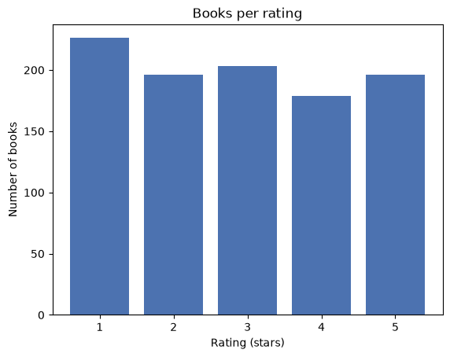
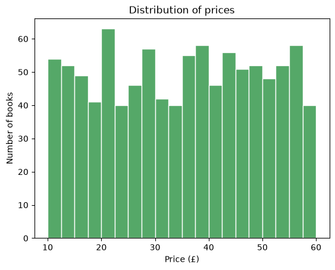
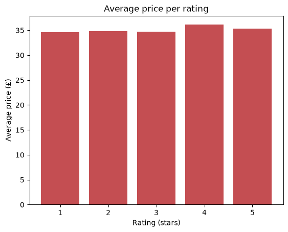

# BooksToScrapeR

An end-to-end data project that scrapes all 1000 books from
[books.toscrape.com](https://books.toscrape.com), cleans and analyzes the data
with **pandas**, visualizes it with **matplotlib**, and serves the results as a
small **Flask + Bootstrap** website.

Built phase-by-phase as a learning project — see [GUIDE.md](GUIDE.md) for the
full roadmap and the tools introduced at each step.

## What it does

1. **Scrape** — crawls all 50 catalogue pages (with a polite delay) and extracts
   each book's title, price, star rating, and availability.
2. **Clean & store** — converts prices to floats and ratings to numbers, then
   saves a tidy `data/books.csv`.
3. **Analyze** — computes totals, average price per rating, the priciest books,
   and stock counts.
4. **Visualize** — renders three charts into `charts/`.
5. **Serve** — a Flask site with a stats-and-charts dashboard plus a browsable
   table of every book.

## Project structure

```
BooksToScrapeR-BTSR/
├── scraper.py          # scrape all pages -> clean -> data/books.csv
├── analyze.py          # print summary statistics
├── visualize.py        # build the 3 charts in charts/
├── data/books.csv      # scraped, cleaned dataset (1000 rows)
├── charts/             # generated PNG charts
├── webapp/             # Flask app
│   ├── app.py
│   ├── templates/      # base.html, index.html, books.html (Jinja + Bootstrap)
│   └── static/charts/  # charts served by the site
├── requirements.txt
├── README.md
└── GUIDE.md
```

## Setup

```powershell
python -m venv .venv
.\.venv\Scripts\Activate.ps1
pip install -r requirements.txt
```

## Run

```powershell
python scraper.py                 # scrape all 1000 books -> data/books.csv (~1 min)
python analyze.py                 # print analysis to the console
python visualize.py               # regenerate charts/ PNGs
python webapp/app.py              # serve the site at http://127.0.0.1:5000
```

## Findings

Analysis of all **1000 books**:

- **Average price:** £35.07
- **In stock:** 1000 of 1000 books
- **Average price per rating** is nearly flat — rating barely affects price:

  | Rating | Avg price | Count |
  |:------:|:---------:|:-----:|
  | ★1 | £34.56 | 226 |
  | ★2 | £34.81 | 196 |
  | ★3 | £34.69 | 203 |
  | ★4 | £36.09 | 179 |
  | ★5 | £35.37 | 196 |

- **Most expensive books** all cluster just under £60 (the site's apparent price
  ceiling): *The Perfect Play* (£59.99), *Last One Home* (£59.98),
  *Civilization and Its Discontents* (£59.95).

## Charts

| Books per rating | Price distribution | Avg price per rating |
|---|---|---|
|  |  |  |
